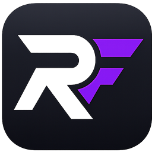

# 👋 Hi, I'm Rafael Carvalho

 

<h1>Full Stack Software Engineer</h1>

Building modern SaaS products with a strong focus on performance, user experience and scalable architecture.

🇫🇷 Paris • 🇵🇹 Portuguese • 🇫🇷 French • 🇬🇧 English

---

# 🚀 About

I'm a Full Stack Software Engineer passionate about designing and building production-ready SaaS applications from the ground up.

My work focuses on modern web technologies, scalable architecture and delivering polished user experiences with high performance.

Currently building **Ryfio**, a Print-on-Demand platform that combines product customization, cloud infrastructure and ecommerce into a complete SaaS solution.

---

# 💼 Current Project

##  Ryfio

**Modern Print-on-Demand SaaS Platform**

Ryfio enables creators and brands to design, customize and sell products online without inventory.

### Highlights

* Advanced Canvas Editor
* AI Mockup Generation
* Authentication
* Product Dashboard
* Product Management
* Print-ready Export
* Responsive Design
* SEO Optimized
* Cloud Storage
* Mobile-first UX

### Tech

Next.js • React • TypeScript • Tailwind CSS • Supabase • PostgreSQL • Firebase • Vercel

🌐 https://ryfio.com

---

# ⚙ Tech Stack

## Frontend

## Backend

## Database

## Tools

---

# 📈 GitHub Stats

---

# 🧠 What I'm Currently Learning

* Advanced System Design
* Distributed Systems
* Scalable Backend Architecture
* AI Integrations
* Performance Optimization
* Clean Architecture

---

# 🎯 Goals

* Build products used by thousands of users.
* Contribute to high-impact engineering teams.
* Continue improving developer experience and product quality.
* Create scalable SaaS products with excellent UX.

---

# 🌍 Languages

🇵🇹 Portuguese — Native

🇫🇷 French — Professional

🇬🇧 English — Professional

---

# 📫 Contact

📧 [rafynhabussiness@gmail.com](mailto:rafynhabussiness@gmail.com)

🌐 https://ryfio.com

💼 https://www.linkedin.com/in/rafael-carvalho-709064408/

🐙 https://github.com/mixrafynha

---

### Building products that people enjoy using.

⭐ If you like my work, feel free to explore my repositories.

